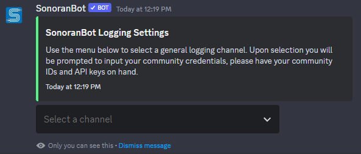

# Getting Started

Sonoran Bot supports role sync with [Sonoran CAD](sonoran-cad-integration.md) and [Sonoran Radio](sonoran-radio-integration.md). Or, Sonoran Bot can sync roles with [Sonoran CMS](sonoran-cms-integration/) ranks. CMS ranks manage CAD, Radio, Drive, website, whitelisting, and more.


All commands require at least the `Manage Server` permission on the Discord server you are running the commands in. You will also need a number of other permissions upon inviting the bot.


### 1. Invite the Bot to Your Server

Inviting Sonoran Bot

[Invite the bot to your Discord server](https://sonoranbot.com/invite). You must have the "Manage Server" permission to add bots; plus any permissions the bot requires to function. You will also be joined to our support server (Sonoran Software Systems) automatically.

### 2. Setup the Bot and Link your Communities

Setting up Sonoran Bot

After inviting the bot, run the `/settings` command. You will then be prompted to select a logging channel for Sonoran Bot to use.

Next, the bot will ask you if you are using Sonoran CMS or if you wish to manage Sonoran CAD/Radio manually with Discord roles.

<figure><figcaption></figcaption></figure> <figure><figcaption></figcaption></figure>

Enter your community ID and API key for [Sonoran CAD](https://docs.sonoransoftware.com/cad/api-integration/getting-started/retrieving-your-credentials) and/or Sonoran Radio.

If you are using [Sonoran CMS](https://sonorancms.com/) to manage your community, you only need to enter your [CMS community ID and API key](https://docs.sonoransoftware.com/cms/developer-api-documentation/api-integration/getting-started/retrieving-your-credentials). Sonoran CMS manages your [CAD](https://docs.sonoransoftware.com/cms/integration-capabilities/sonoran-cad-sync) and [Radio](https://docs.sonoransoftware.com/cms/integration-capabilities/sonoran-radio-sync) permissions inside the app with CMS user ranks.

### 3. Invite to Additional Servers

If your community uses multiple discord servers, you can link them all to the same community to utilize the permissions sync easily. Simply set them up normally as you just did, and they will automatically be synced! You will be able to use the bot's commands just like on the primary server.

### 4. Set up Integrations

At this point, you will need to select either CAD or CMS integration. We highly encourage users to make use of the CMS integration as the CMS can integrate with the CAD on its own!

* [CMS Integration](sonoran-cms-integration/)&#x20;
* [CAD Integration](sonoran-cad-integration.md)
* [Radio Integration](sonoran-radio-integration.md)
* [Settings](usage/settings.md)&#x20;
* [Commands](usage/commands.md)
