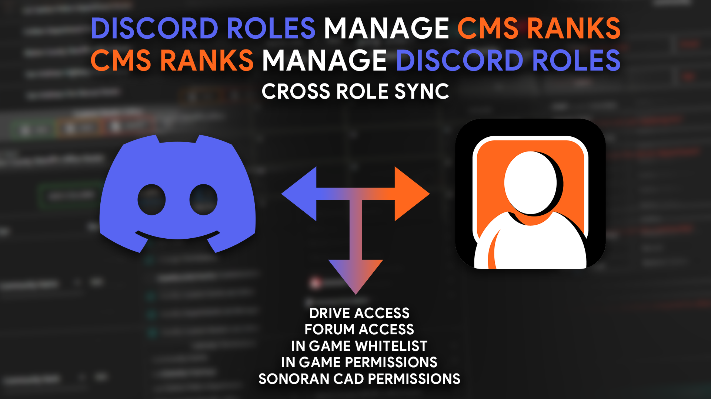

# Sonoran CAD Integration

## Manage with Sonoran CMS!


Use Sonoran CMS to link your discord roles to CMS and CAD permissions instead if you plan to/already use Sonoran CMS. Simply [link Sonoran Bot to Sonoran CMS](sonoran-cms-integration/) and setup [Sonoran CMS -> Sonoran CAD permission sync](https://info.sonorancms.com/integration-capabilities/sonoran-cad-sync)&#x20;


In addition to automatically adding users when applications are accepted, [Sonoran CMS](https://info.sonorancms.com/why-choose-sonoran-cms/why-choose-sonoran-cms) can also manage your community's CAD permissions!

If you don't use CMS, don't worry! [You can still set up CAD role mapping normally](sonoran-cad-integration.md#cad-integration).

[Learn more today!](https://info.sonorancms.com/why-choose-sonoran-cms/why-choose-sonoran-cms)

## Sonoran CAD Integration Guide 

### Setup Guide



### Permissions Synchronization


Additionally, you must have the Manage Server permission on the Discord server in order to set up this process.


The bot provides a brand new menu to assist you with assigning roles to permissions. To start, select the role you wish to map permissions to from the dropdown.

Once you've selected a role, you can use the linked tool to toggle what permissions that a user with this role should receive. It will generate a number corresponding to the selected permissions that you can copy and input in the next step.

Clicking `Set Mapping` will present an option to specify a code (generated using the linked tool) or an existing permission key. Enter "0" as the permission mask to delete the current mapping instead.

Successfully entering this information will bring you back to the main role mapping screen with the new permission set.


If you've linked your Discord to CMS, CAD permissions will be handled by CMS > CAD integration


### User Setup

1. Every user in the Discord will get their [Secret ID from their Settings page](https://info.sonorancad.com/sonoran-cad/api-integration/getting-started/account-secret-id).
2. Every user in the Discord will then use `/linkme` to link their Sonoran CAD account to their current Discord account. This will automatically populate their API ID.
3. Community members can use the `/sync` command in Discord to force a permissions sync.
4. Communities should **no longer use public permission keys in the CAD**, as the bot will automatically remove CAD permissions from users if they don't have a Discord role for it.

Now, whenever a role is added or removed, the bot will automatically update the user's permissions to match! If the user ever leaves the server, the bot will immediately remove all permissions from their account, although they will still be in the community.

#### Changing your Account Secret ID

Sometimes, you may wish to change your secret ID. If you do so, you must run `/linkme` again or the bot will remove all your permissions on Sonoran CAD (if the optional security setting below is enabled).

### Best Practices and FAQ

* It is advised to not sync potentially dangerous permissions (such as Admin Access permissions) with Discord roles **unless** you trust staff with that role, or it's just you.
* The community owner is completely ignored during the synchronization process.
* "Principle of Least Privilege" should be exercised during this setup. Don't give out permissions you don't think users performing the role would need.
* Discontinue use of permission keys ASAP. The bot "takes over" synchronization and will remove permissions granted by permission keys if they don't have a role that grants it.
  * Same goes for manual permission grants, **unless there is no role granting that permission**.
