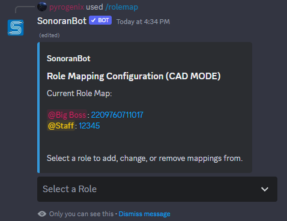

# Sonoran CAD Integration

## Sync Discord Roles to CAD Permissions

Easily manage Sonoran CAD permissions by syncing them with Discord roles.

To sync Discord roles with CAD permissions you will need **either**:

[Option 1](sonoran-cad-integration.md#id-1.-via-sonoran-cms): A **Free** community on Sonoran CAD and Sonoran CMS

[Option 2](sonoran-cad-integration.md#cad-integration): A **Free** community on Sonoran CAD

## 1. Via Sonoran CMS

Role sync with Sonoran CMS

In addition to automatically adding users to your CAD when applications are accepted, [Sonoran CMS](https://info.sonorancms.com/why-choose-sonoran-cms/why-choose-sonoran-cms) can also manage your community's CAD and [Radio](https://info.sonorancms.com/integration-capabilities/sonoran-radio-sync) permissions!

1. [Add Sonoran Bot to your Discord](getting-started.md)
2. [Map Discord Roles to CMS Ranks](sonoran-cms-integration/role-mapping.md)
3. [Map CAD Permissions to CMS Ranks](https://info.sonorancms.com/integration-capabilities/sonoran-cad-sync)

<figure><figcaption></figcaption></figure> <figure><figcaption></figcaption></figure>

## 2. Via Sonoran CAD 

### Setup Guide



### Permissions Synchronization


Additionally, you must have the Manage Server permission on the Discord server in order to set up this process.


Using the `/rolemap` command, select the role you wish to map permissions to from the dropdown.

Use the tool linked in the embed to generate a permission mapping number.

Clicking **Set Mapping** will present an option to specify a code (generated using the linked tool) or an existing permission key. Enter "0" as the permission mask to delete the current mapping instead.

Successfully entering this information will bring you back to the main role mapping screen with the new permission set.

### User Setup

1. Every user in the Discord will get their [Secret ID from their Settings page](https://info.sonorancad.com/sonoran-cad/api-integration/getting-started/account-secret-id).
2. Every user in the Discord will then use `/linkme` to link their Discord to their Sonoran Software account.
3. Community members can use the `/sync` command in Discord to force a permissions sync.
4. Communities should **no longer use public permission keys in the CAD**, as the bot will automatically remove CAD permissions from users if they don't have a Discord role for it.

Whenever a role is added or removed, the bot will automatically update the user's permissions to match.

If the user ever leaves the server, the bot will immediately remove all permissions from their account, although they will still be in the community.

### Best Practices and FAQ

Best Practices and FAQ

* It is advised to not sync potentially dangerous permissions (such as Admin Access permissions) with Discord roles **unless** you trust staff with that role, or it's just you.
* The community owner is completely ignored during the synchronization process.
* "Principle of Least Privilege" should be exercised during this setup. Don't give out permissions you don't think users performing the role would need.
* Discontinue use of permission keys ASAP. The bot "takes over" synchronization and will remove permissions granted by permission keys if they don't have a role that grants it.
  * Same goes for manual permission grants, **unless there is no role granting that permission**.

