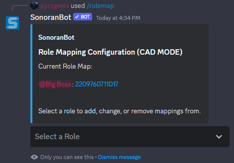
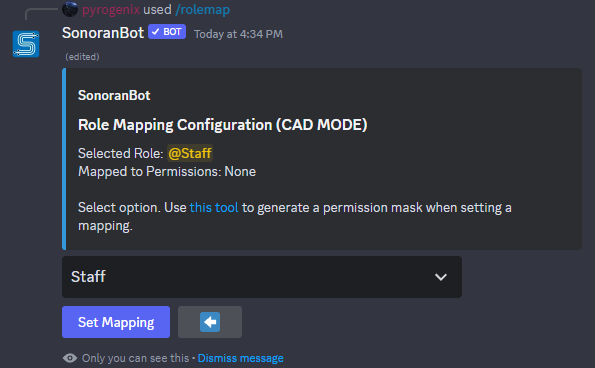
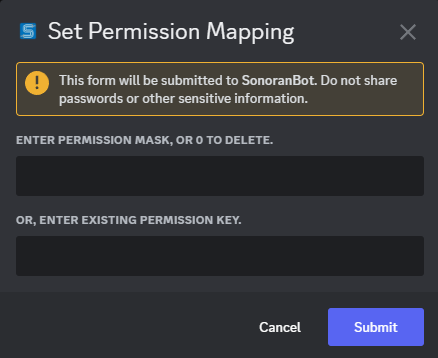

# Sonoran CAD Integration

## Sync Discord Roles to CAD Permissions

Sonoran Bot makes managing your Sonoran CAD permissions a breeze! Map specific permissions to Discord roles. Users with those Discord roles will be granted the assigned permissions.


Sonoran CAD role mapping is not available when Sonoran Bot is in CMS mode. Sonoran CMS manages your [CAD](https://docs.sonoransoftware.com/cms/integration-capabilities/sonoran-cad-sync) and [Radio](https://docs.sonoransoftware.com/cms/integration-capabilities/sonoran-radio-sync) permissions inside the app with CMS user ranks.


## Setup

### 1. Invite the Bot and Link Your CAD

Inviting and Linking Your CAD

If you have not already, be sure to [invite the Discord bot and link your CAD community ID and API key](getting-started.md).

If you already have Sonoran Bot configured for another product, you can add the CAD community ID and API key in the `/settings` menu under **API Menu** > **Change CAD Setup**.

<figure><figcaption>
<code>/settings</code> -> <code>API Menu</code> -> <code>Change Radio Setup</code>
</figcaption></figure>

After the Radio credentials are saved, the bot enables one of these sync modes automatically:

* `RADIO` if only Radio is configured
* `CAD_RADIO` if both CAD and Radio are configured
* `CMS_BIDIR` if CMS is configured


CMS takes priority over CAD and Radio sync. If CMS credentials are present, live role sync runs through the CMS path until CMS is removed from the community setup.



CAD credentials are saved without setup-time validation. The first real validation usually happens when you open the CAD role mapping menu or run `/sync`.


### 2. Configure Role Mapping

Configuring CAD Role Mapping

Run `/rolemap` to configure how Discord roles translate into Sonoran CAD access.

If your community is in `CAD_RADIO` mode, the bot first asks whether you want to manage CAD mappings or Radio mappings. If your community is in `CAD` mode, the bot opens the CAD mapping menu directly.

<figure><figcaption>
<code>/rolemap</code> product selector in <code>CAD_RADIO</code> mode
</figcaption></figure> 

Select the Discord role you wish to map to specific CAD permissions. The embed will link you to a [permission bit map generator](https://sonoran-software.github.io/sonoranbot-perms). Toggle the specific CAD permissions and copy the code below.

  <figure><figcaption>
CAD Permission Bit Map Generator
</figcaption></figure>

To delete an existing role mapping, edit it and enter `0` as the value.

### 4. Syncing Users

Syncing User Permissions

In order for the bot to sync users in your CAD community, their Sonoran account must be linked to Discord. Users can run `/linkme` to link their Discord to their Sonoran Software account.


User permissions are synced across all linked Discord guilds. If you have multiple Discord servers linked to the same Sonoran community, the bot gathers all of them and checks the member's roles across every linked server that the bot is in.


**Automatic Sync**

Sonoran Bot will automatically sync and update Radio permissions on:

* Discord role changes
* Members exiting the Discord guild
* Members being banned from the Discord guild

**Manual Sync**

Users can run `/sync` to force a manual permission sync.

Administrators can force a community-wide sync by running `/sync community: yes`

### Best Practices and FAQ

Best Practices and FAQ

* It is advised to not sync potentially dangerous permissions (such as Admin Access permissions) with Discord roles **unless** you trust staff with that role, or it's just you.
* The community owner is completely ignored during the synchronization process.
* "Principle of Least Privilege" should be exercised during this setup. Don't give out permissions you don't think users performing the role would need.
* Discontinue use of permission keys ASAP. The bot "takes over" synchronization and will remove permissions granted by permission keys if they don't have a role that grants it.
  * Same goes for manual permission grants, **unless there is no role granting that permission**.

