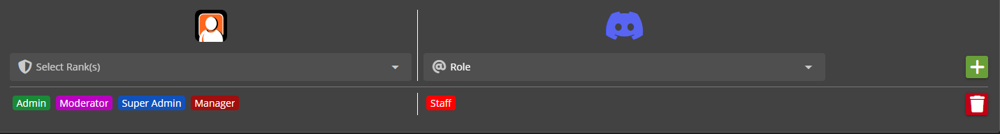

# Promotion Flows

## Triggering a Promotion Flow

You can trigger a Sonoran CMS [promotion flow](https://docs.sonoransoftware.com/cms/tutorials/user-management/rank-promotions) via the following commands

* `/promote`&#x20;
* `/demote`&#x20;

These commands can be used to trigger specific rank changes you have prior configured on Sonoran CMS. You can select up to 5 users at a time to trigger this flow on.&#x20;

<figure><figcaption>
SonoranBot - Select up to 5 users
</figcaption></figure>

Flow names are based on the ranks they add/ remove. You can type to begin searching for a specific flow you are looking for as shown below:

<figure><figcaption>
SonoranBot - Searching for specific promotion flows
</figcaption></figure>

Upon successfully running a flow the users ranks will be updated in Sonoran CMS.

<figure><figcaption>
SonoranCMS - Rank updated
</figcaption></figure> <figure><figcaption>
SonoranBot - Promotion Flow sucessful message
</figcaption></figure>

