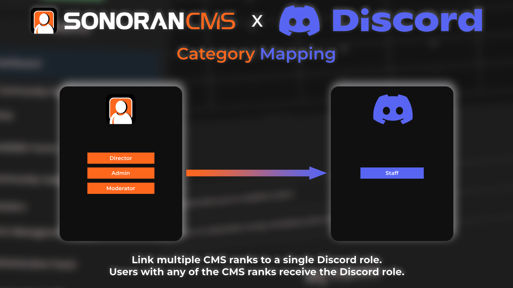

# Role Mapping

## Mapping Discord Roles and CMS Ranks

In the `Administration` panel of the CMS, navigate to `Integrations` > `Discord` > `Role Mapping`

Configure your CMS x Discord [One-to-One](role-mapping.md#one-to-one-mapping) and [Category](role-mapping.md#category-mapping) mappings below.

## One-to-One Mapping

<figure><figcaption>
CMS x Discord: One-to-One Mapping
</figcaption></figure>

One-to-One Mapping Explained

One-to-one mapping allows you to map a CMS rank to one or more Discord roles. Adding or removing a one-to-one mapped rank in the CMS will add or remove the Discord role and vice versa.

This mapping type is the most common.

* CMS: `Admin` rank
* Discord: `Admin` role in one or more Discord guilds

.png>)

## Category Mapping

<figure><figcaption>
CMS x Discord: Category Mapping
</figcaption></figure>

Category Mapping Explained

Category mapping allows you to map multiple CMS ranks to a single Discord role. If a user has any of the CMS ranks they will receive the Discord role. If a user has none of the CMS ranks the Discord role will be removed.

This mapping type is best used for role categories.

* CMS: Multiple staff ranks `Moderator`, `Admin` and `Director`
* Discord: A general `Staff` role

.png>)

## Syncing the Role Map


After modifying the mapping, your community will automatically be re-synced.\
This may take a couple of minutes to complete.


While changes are automatic, you can also manually re-sync users with the `/sync` command.

Setting the flag `community` to `Yes` will sync your entire community including any linked guilds. Setting it to no or running `/sync` by itself will only sync the server you run it in.
