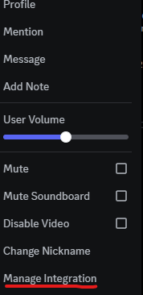
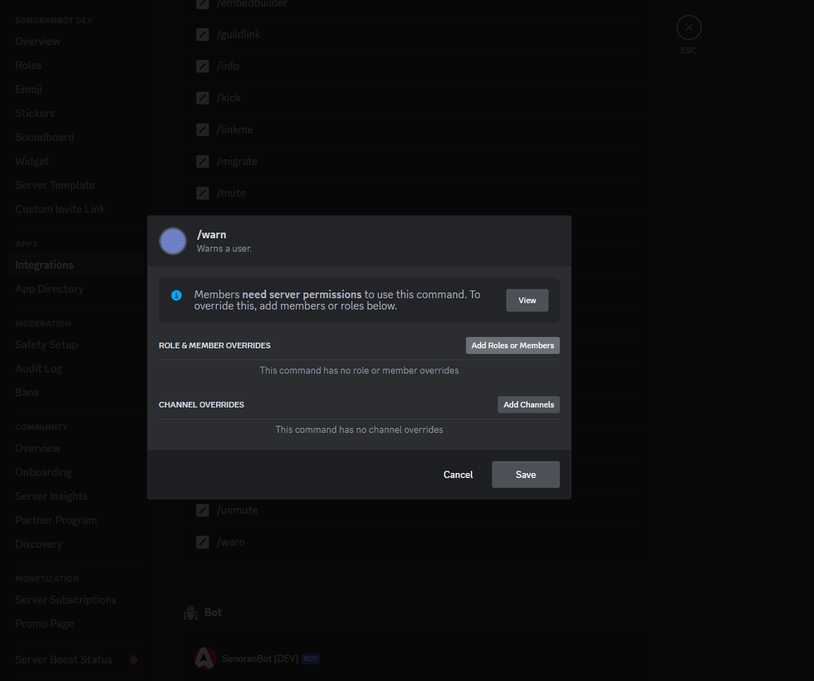
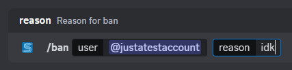
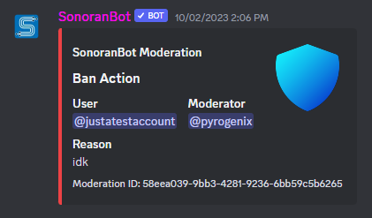
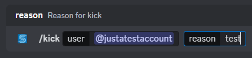
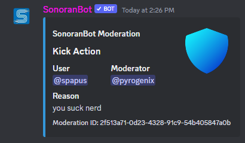
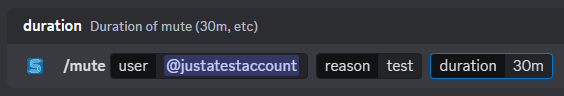
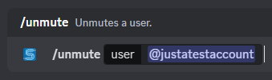
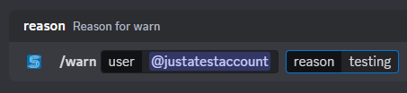
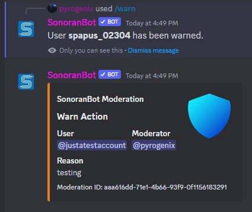

# Moderation

Using SonoranBot, you have access to several commands that are all logged to a special channel. Keep moderation actions organized and easily control access!


Moderation commands are available to any Discord server linked to a community, including those on the Free version of CAD and/or CMS!


## Getting Started

### Set Permissions


The permissions in the below table are also what SonoranBot will need to perform them, otherwise you will get an error message.


By default, all commands are set to what you expect:

| Command | Required Permission       |
| ------- | ------------------------- |
| `/ban`  | Ban Members               |
| `/kick` | Kick Members              |
| `/mute` | Timeout Members           |
| `/warn` | Manage Guild ("disabled") |

The `/warn` command is attached to Manage Guild by default like all other commands - you will want to give this command to certain roles as desired. This can be accomplished within Discord's Integrations settings (Desktop/Web only).

Managing integration permissions is outside the scope of this guide, but Discord [has a guide](https://support.discord.com/hc/en-us/articles/4644915651095-Command-Permissions) of their own to walk you through the process. Chances are, you've already done this if you're using the CAD/CMS integrations.

## Usage Examples

When a command is used, a logging entry will be created depending on the action.

### Ban/Unban

 

***

### Kick

 

***

### Mute/Unmute

 

***

### Warn

 
