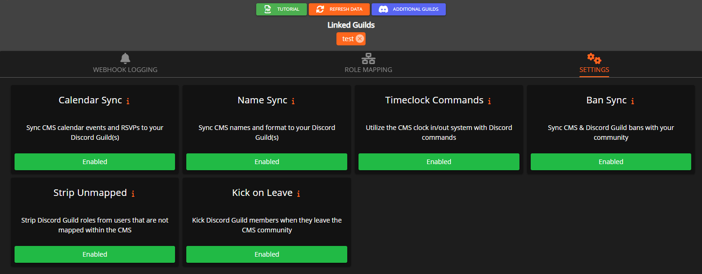

# Settings

Running the command `/settings` allows you to manage many different aspects of how Sonoran Bot interacts with your Discord and CMS.

## API Settings 

Within the `/settings` menu, you can select API Settings, which will give you the options to change or delete the settings for your linked CAD and CMS communities.

## CMS Settings 

#### CMS Settings Menu

Many of the following settings can be toggled from within CMS in the settings menu located at  `Admin` > `Integrations` > `Discord` > `Settings`

<figure><figcaption>
Sonoran CMS - Discord Settings
</figcaption></figure>

Within the `/settings` menu, you can select CMS Settings to change different settings related to how Sonoran Bot syncs with your CMS community. Within this menu, you can customize settings in the following categories:

### [Calendar Sync](../sonoran-cms-integration/calendar-event-sync.md) 

Allows you to toggle sync between CMS calendar events and your Discord. Enabling this will create a Discord event for any calendar events created in CMS.

This can also be toggled from CMS in `Admin` > `Integrations` > `Discord` > `Settings`

### Name Sync 

Allows you to toggle Name Sync. Enabling this will automatically change the nicknames of all users in the server to their corresponding CMS community names.

The name it shows is whatever you've set in [CMS's Name Customizations settings](https://info.sonorancms.com/tutorials/customization/community-branding-and-settings#community-name-customization).

Thus, a hypothetical user whose name is displayed as `John Doe | 1A` would receive that as a nickname in Discord.

This can also be toggled from CMS in `Admin` > `Integrations` > `Discord` > `Settings`

### Clock In/Out 

Toggles the ability to clock in and out in CMS from Discord. If enabled, users can do `/clockincms` to clock in or `/clockoutcms` to clock out. This will automatically send clock information to CMS.

For more information on CMS's time clock system, [see its documentation here](https://info.sonorancms.com/tutorials/forms/clock-in-out-system).

This can also be toggled from CMS in `Admin` > `Integrations` > `Discord` > `Settings`

### Ban Sync

Syncs CMS & Discord Guild bans with your community. If a user is banned from one, they will also automatically be banned from the other, and vice versa. Banning a user in a linked Discord guild will also ban them in the CMS.

This can also be toggled from CMS in `Admin` > `Integrations` > `Discord` > `Settings`

## Role Sync Settings 

### Toggle Kick On Leave

This will automatically remove a user from CMS if they leave or are banned from the Discord.&#x20;

Likewise, it will also automatically remove a user from the Discord Guild if they leave the CMS community.

This can also be toggled from CMS in `Admin` > `Integrations` > `Discord` > `Settings`

## Logging Settings 

Allows you to set or change the General logging channel and the Moderation logging channel.

